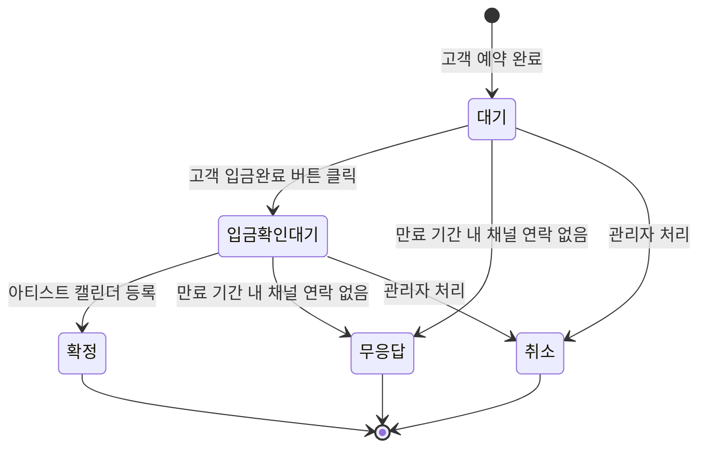
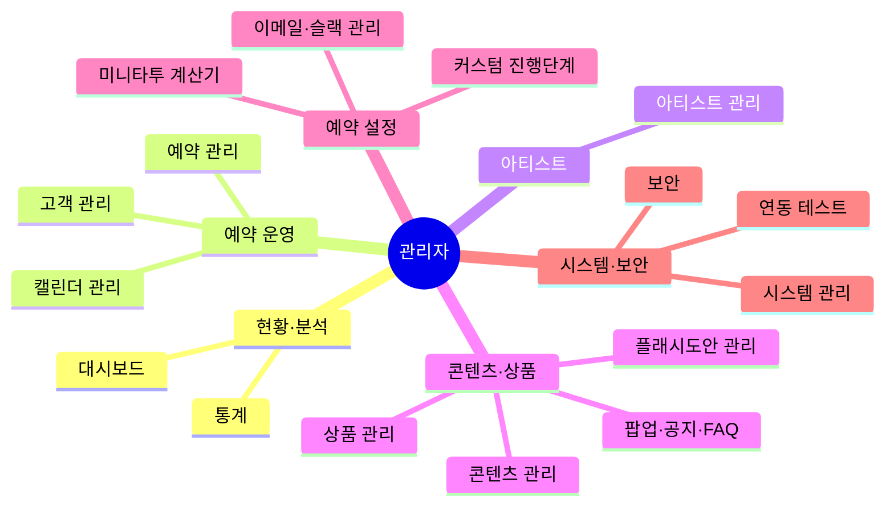
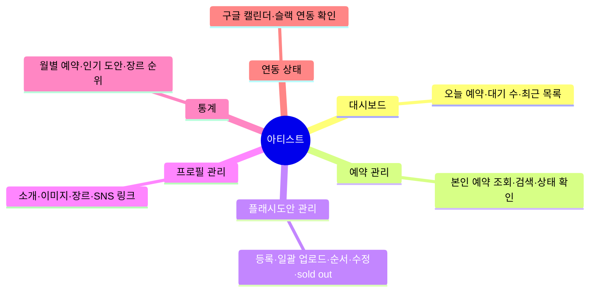
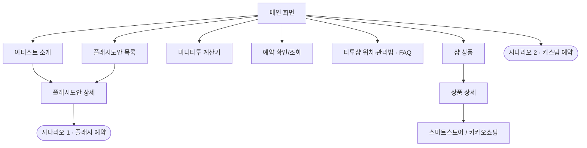
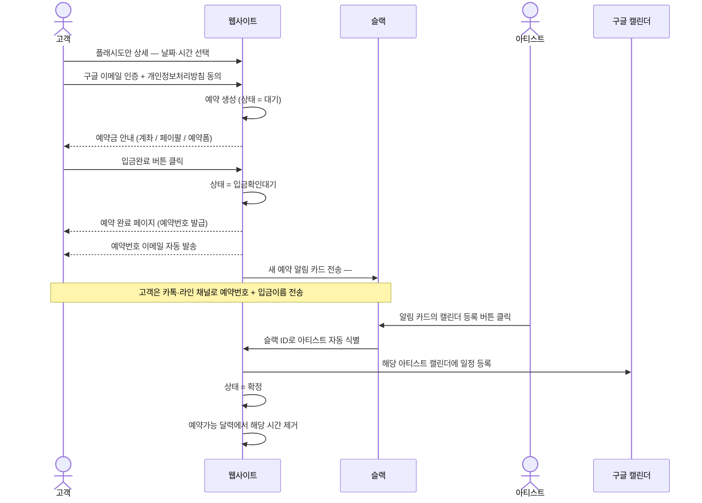
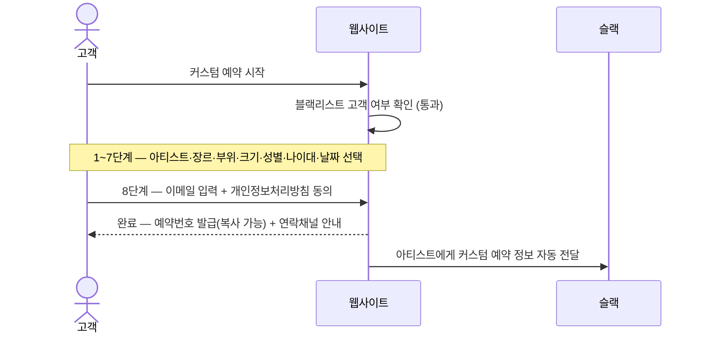
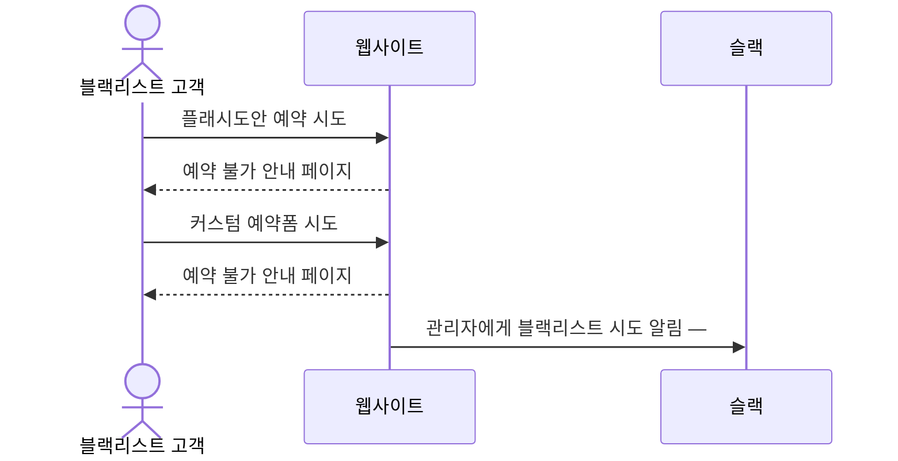
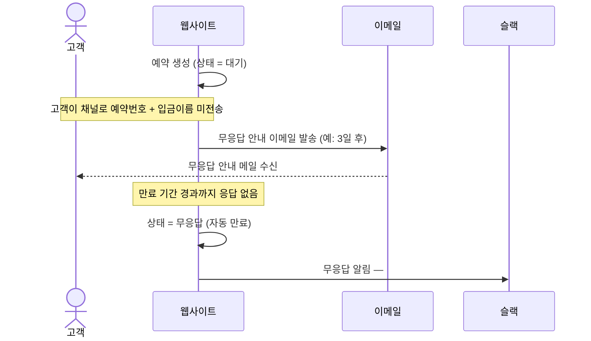

# tattoo_project

타투샵 예약·관리 플랫폼. **관리자 · 아티스트 · 고객** 3개 역할로 구성된다.

## 모노레포 구조

```
apps/api              Spring Boot 4 · Java 17 · MyBatis · MySQL · JWT
apps/web              Next.js 16 App Router · React 19 · Tailwind v4
packages/contract     ★ 단일 진실 — 도메인 타입 · DB 스키마 · 시드 · 화면흐름 매핑
packages/api-client   엔드포인트 상수 · 에러 정규화 · fetch 래퍼
packages/ui           블랙 & 화이트 디자인 시스템
db/                   생성물 — schema.sql · migrate-from-current.sql · seed.sql
```

의존 방향은 한쪽이다. `contract`는 아무것도 모르고, 위로 갈수록 알게 된다.

```
contract  ←  api-client  ←  apps/web
```

```bash
pnpm install
cp apps/web/.env.example apps/web/.env.local

pnpm dev          # 프론트 (localhost:3000) — 백엔드·DB 없이도 모든 화면 동작
pnpm api:dev      # 백엔드 (localhost:8080)
```

| 문서                                         | 내용                                                                        |
| -------------------------------------------- | --------------------------------------------------------------------------- |
| [docs/API-CONTRACT.md](docs/API-CONTRACT.md) | 프론트가 기대하는 API 규격 · **백엔드에 먼저 고쳐야 할 것** · 구현 우선순위 |
| [docs/ERD.md](docs/ERD.md)                   | 테이블 관계도 · 컬럼 명세 · 화면흐름↔컬럼 대응 (생성물)                    |
| [docs/FRONTEND.md](docs/FRONTEND.md)         | 디자인 시스템 · 퍼널 UX · 인증 구조 · 목→실API 교체 방법                    |

---

# 데이터는 지금 어디에 쌓이는가

**아무 데도 쌓이지 않는다.** 지금은 데모 상태이고, 데이터는 Next.js Node 프로세스의
메모리에만 있다.

```
현재 (DATA_SOURCE=mock)
  브라우저 → Next 서버 → apps/web/src/data/mock.ts 의 모듈 변수 (RAM)
                          └ 서버 재시작 · 핫리로드 = 시드 상태로 초기화
  MySQL ← 아무것도 가지 않는다

DB 연결 후 (DATA_SOURCE=http)
  브라우저 → Next 서버(BFF) → Spring → MyBatis → MySQL
```

예약을 만들고 새로고침하면 남아 있지만, `pnpm dev`를 껐다 켜면 시드 7건으로 돌아간다.
워커가 여러 개인 환경에서는 워커 간에도 공유되지 않는다.

## MySQL 연결하기

`db/`의 SQL은 전부 `packages/contract`에서 생성된 것이고, **MySQL 9.6에서 실제로 실행해
검증했다** (스키마 · 시드 · 마이그레이션 · CHECK·UNIQUE·FK 제약 동작 확인).

### 1. 스키마 올리기

새 DB라면:

```bash
mysql -u root -p < db/schema.sql       # DB 'tattoo' 생성 + 테이블 16개
mysql -u root -p < db/seed.sql         # 데모 데이터 (화면에서 보이는 것과 동일)
```

이미 `admin_tb` · `artist_tb`가 있다면 마이그레이션을 쓴다:

```bash
mysql -u root -p < db/migrate-from-current.sql
```

> 이 스크립트는 기존 3개 테이블의 컬럼 구성이 `apps/api` 엔티티 필드와 1:1이라고
> 가정한다. 실제 DB와 다르면 `packages/contract/src/tables.ts`의 `existing` 플래그를
> 고치고 `pnpm db:generate`를 다시 돌린다. **운영 DB에 적용하기 전에 백업할 것.**

### 2. 백엔드 접속 정보 작성

`application.yml`은 `.gitignore` 대상이라 저장소에 없다. 직접 만들어야 한다.

```yaml
# apps/api/src/main/resources/application.yml
spring:
  datasource:
    url: jdbc:mysql://localhost:3306/tattoo?serverTimezone=Asia/Seoul&characterEncoding=UTF-8
    username: root
    password: ${DB_PASSWORD}
    driver-class-name: com.mysql.cj.jdbc.Driver

mybatis:
  mapper-locations: classpath:mappers/*.xml
  configuration:
    # DB의 snake_case를 엔티티의 camelCase로 자동 매핑한다.
    # 이게 없으면 artist_name이 artistName에 들어가지 않아 값이 전부 null이 된다.
    map-underscore-to-camel-case: true

jwt:
  # 현재 JwtUtil에 하드코딩된 값은 git 히스토리에 노출되었다. 새 값으로 교체할 것.
  secret: ${JWT_SECRET}
```

### 3. 미구현 매퍼 채우기

`CustomReservationMapper` · `FlashDesignMapper` · `FlashReservationMapper` · `UserMapper`가
`@Mapper public class`로 되어 있다. MyBatis는 **인터페이스**만 프록시하므로 컴파일은 통과하고
런타임에 동작하지 않는다. `interface`로 바꾸고 SQL을 작성해야 한다.

필요한 엔드포인트와 응답 규격은 [docs/API-CONTRACT.md](docs/API-CONTRACT.md)에 있다.

### 4. 프론트 전환

```bash
# apps/web/.env.local
DATA_SOURCE=http     # mock → http
MOCK_AUTH=0
```

구현되지 않은 엔드포인트는 404(`NOT_FOUND`)가 난다. **그게 의도된 동작이다** — 목으로
조용히 대체하면 "구현됐다"고 착각하게 된다. 엔드포인트를 하나씩 구현하며 화면을 순차적으로
살리면 된다.

---

# 스키마를 바꿀 때 (하네스)

화면 흐름이 바뀌면 DB도 따라 바뀌어야 한다. 이걸 사람의 기억에 맡기면 반드시 어긋나므로,
**단일 진실 + 자동 검출**로 묶어 두었다.

```
packages/contract/src/
├─ domain.ts     도메인 타입 · 예약 상태 코드 · 상태 전이 규칙
├─ tables.ts     ★ 테이블·컬럼 선언
├─ flows.ts      ★ 퍼널 단계 ↔ 컬럼 매핑, 저장소 메서드 ↔ 엔드포인트 매핑
└─ seed.ts       데모 데이터 (프론트 목과 DB 시드가 공유)
        │
        │  pnpm db:generate
        ▼
db/schema.sql · db/migrate-from-current.sql · db/seed.sql · docs/ERD.md
```

`db/*.sql`과 `docs/ERD.md`는 **생성물이다.** 직접 수정하면 `pnpm db:check`가 실패한다.

## 작업 순서

```bash
# 1. contract를 고친다 (tables.ts / flows.ts / domain.ts / seed.ts)
# 2. 생성
pnpm db:generate
# 3. 검사
pnpm db:check
```

| 명령               | 하는 일                                                     |
| ------------------ | ----------------------------------------------------------- |
| `pnpm db:generate` | contract → `db/*.sql`, `docs/ERD.md` 생성                   |
| `pnpm db:check`    | 화면 · 계약 · 스키마가 어긋났는지 검사 (실패 시 종료코드 1) |

`pnpm db:check`는 커밋 전이나 CI에서 돌린다. 검사 항목:

| #   | 검사                                                                   |
| --- | ---------------------------------------------------------------------- |
| 1   | `db/*.sql`·`docs/ERD.md`가 contract와 일치하는가 (생성 잊음·직접 수정) |
| 2   | 퍼널 코드의 `STEPS` 배열이 `flows.ts`와 같은가 (개수·이름·순서)        |
| 3   | 각 단계가 채운다고 선언한 컬럼이 `tables.ts`에 존재하는가              |
| 4   | NOT NULL인데 어떤 단계도 채우지 않는 컬럼이 있는가                     |
| 5   | 건너뛸 수 있는 단계의 컬럼이 NULL을 허용하는가                         |
| 6   | 저장소 메서드와 API 엔드포인트 상수가 짝을 이루는가                    |

## 예: 커스텀 예약에 "예산" 단계를 추가한다면

1. `custom-funnel.tsx`의 `STEPS`에 `'budget'` 추가 → 이 상태로 `db:check`를 돌리면
   **2번이 실패**한다 (화면에만 있는 단계).
2. `flows.ts`에 단계 추가, `collects: ['custom_reservation_tb.budget_range']`
   → **3번이 실패**한다 (없는 컬럼 참조).
3. `tables.ts`의 `custom_reservation_tb`에 `budget_range` 컬럼 추가.
4. `pnpm db:generate` → DDL·마이그레이션·ERD가 갱신된다.
5. `pnpm db:check` 통과. 백엔드는 `db/migrate-from-current.sql`의 새 `ALTER TABLE`만
   적용하면 된다.

거꾸로 컬럼만 추가하고 화면을 잊으면 **4번**에서 잡힌다.

---

아래는 이 플랫폼이 어떻게 동작해야 하는지에 대한 워크플로우 정의다.

## 목차

- [역할 개요](#역할-개요)
- [예약 상태 흐름 (공통)](#예약-상태-흐름-공통)
- [1. 관리자 워크플로우](#1-관리자-워크플로우)
- [2. 아티스트 워크플로우](#2-아티스트-워크플로우)
- [3. 고객 워크플로우](#3-고객-워크플로우)
- [4. 핵심 시나리오](#4-핵심-시나리오)

## 역할 개요

| 역할     | 진입            | 핵심 책임                                             |
| -------- | --------------- | ----------------------------------------------------- |
| 관리자   | 관리자 로그인   | 예약·아티스트·도안·콘텐츠·통계 전체 관리, 시스템 운영 |
| 아티스트 | 아티스트 로그인 | 본인 예약 조회, 본인 도안·프로필 관리, 캘린더 등록    |
| 고객     | 비로그인        | 도안 탐색, 플래시/커스텀 예약, 예약 조회              |

> 로그인 실패 5회 시 계정 잠금. 잠금 해제는 관리자만 가능.

## 예약 상태 흐름 (공통)

세 역할이 공유하는 예약 상태 전이.



---

## 1. 관리자 워크플로우

진입: 관리자 로그인(실패 5회 잠금) · 종료: 로그아웃. 기능을 6개 도메인으로 묶었다.

### 1.1 페이지 구조



### 1.2 기능 상세

| 도메인      | 메뉴             | 핵심 기능                                                                                        |
| ----------- | ---------------- | ------------------------------------------------------------------------------------------------ |
| 현황·분석   | 대시보드         | 오늘 예약·대기 수·최근 목록·월별 통계 그래프                                                     |
| 현황·분석   | 통계             | 기간별 예약·매출, 아티스트·장르별, 인기 도안·장르 순위, 엑셀                                     |
| 예약 운영   | 예약 관리        | 플래시·커스텀 목록(검색·메모·엑셀), 취소·무응답 목록, 블랙리스트 관리                            |
| 예약 운영   | 고객 관리        | 고객 목록, 예약 이력, 재방문 고객 표시                                                           |
| 예약 운영   | 캘린더 관리      | 영업시간, 예약 가능·대기 만료 기간, 휴무일·임시 휴업                                             |
| 아티스트    | 아티스트 관리    | 계정 생성, 노출 순서, 정보 수정(캘린더·슬랙 ID·예약 시간·휴가), 활성화, 비번 초기화, 아이디 찾기 |
| 콘텐츠·상품 | 플래시도안 관리  | 등록·일괄 업로드·순서·수정·삭제, 카테고리·장르, sold out                                         |
| 콘텐츠·상품 | 상품 관리        | 등록·수정·삭제·순서·품절, 카테고리, 스마트스토어 링크                                            |
| 콘텐츠·상품 | 팝업·공지·FAQ    | 팝업·공지사항·FAQ 등록·수정·삭제                                                                 |
| 콘텐츠·상품 | 콘텐츠 관리      | 배너·소개·위치·안내·약관 문구, SNS 링크, 다국어(한/영)                                           |
| 예약 설정   | 미니타투 계산기  | 계산 항목 관리, 예약금 금액 설정(플래시·커스텀)                                                  |
| 예약 설정   | 커스텀 진행단계  | 커스텀 예약 진행단계 수정·삭제                                                                   |
| 예약 설정   | 이메일·슬랙 관리 | 이메일 템플릿·발송 로그·발송 주기, 슬랙 채널별 알림·테스트                                       |
| 시스템·보안 | 연동 테스트      | 슬랙 알림·구글 캘린더 연동 테스트                                                                |
| 시스템·보안 | 보안             | 비밀번호 변경, 계정 추가, 접속 로그, 계정 잠금 해제                                              |
| 시스템·보안 | 시스템 관리      | 시스템 점검 모드(점검 페이지 표시)                                                               |

---

## 2. 아티스트 워크플로우

진입: 아티스트 로그인(실패 5회 잠금) · 종료: 로그아웃. 본인 데이터 범위로 한정된다.

### 2.1 페이지 구조



---

## 3. 고객 워크플로우

비로그인으로 진입한다. 실제 예약 과정은 [4. 핵심 시나리오](#4-핵심-시나리오) 참고.

### 3.1 사이트 구조



---

## 4. 핵심 시나리오

플랫폼의 실제 동작을 역할 간 상호작용 관점에서 정리한다.

### 시나리오 1 — 플래시도안 예약 → 확정 (정상 흐름)



### 시나리오 2 — 커스텀 예약 (8단계)



### 시나리오 3 — 블랙리스트 고객 예약 시도 (차단)



### 시나리오 4 — 무응답 예약 자동 만료


