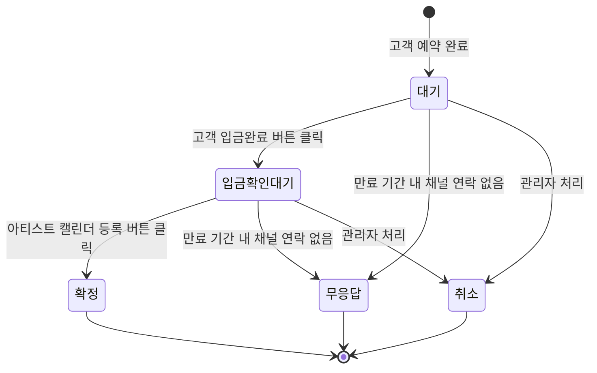
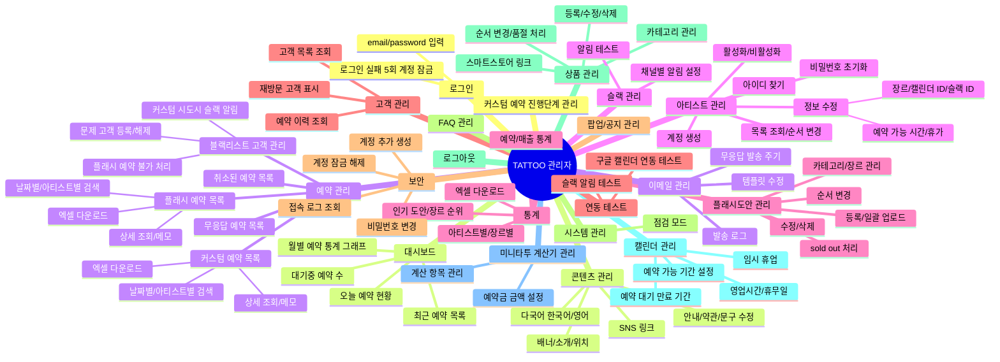
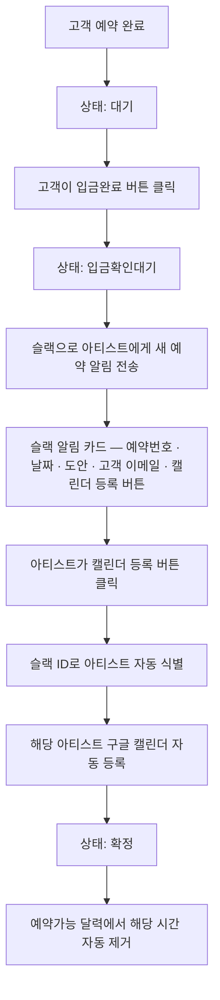
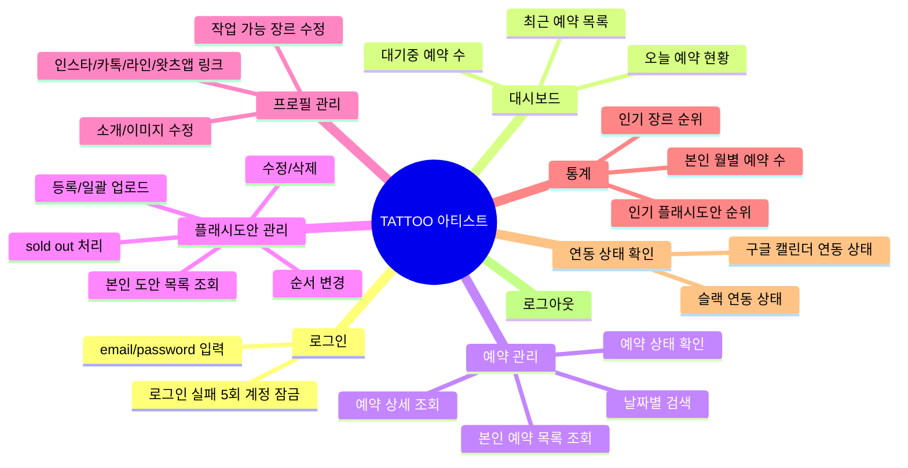
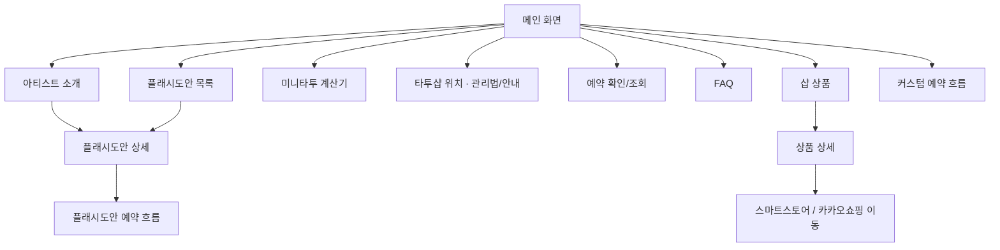
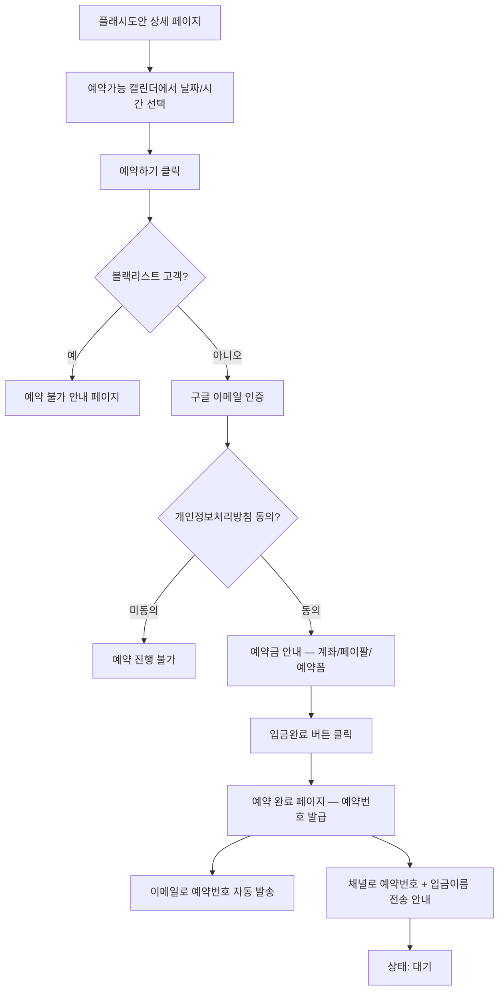
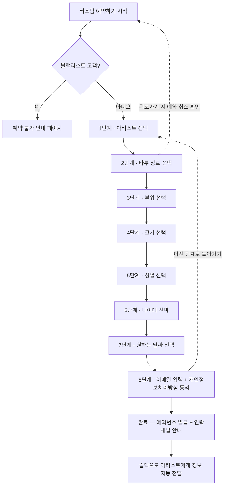

# tattoo_project

타투샵 예약·관리 플랫폼의 워크플로우 문서. **관리자 · 아티스트 · 고객** 3개 역할로 구성된다.

## 목차

- [역할 개요](#역할-개요)
- [예약 상태 흐름 (공통)](#예약-상태-흐름-공통)
- [1. 관리자 워크플로우](#1-관리자-워크플로우)
  - [1.1 관리자 페이지 구조](#11-관리자-페이지-구조)
  - [1.2 예약 확정 흐름 (슬랙 → 구글 캘린더)](#12-예약-확정-흐름-슬랙--구글-캘린더)
- [2. 아티스트 워크플로우](#2-아티스트-워크플로우)
  - [2.1 아티스트 페이지 구조](#21-아티스트-페이지-구조)
- [3. 고객 워크플로우](#3-고객-워크플로우)
  - [3.1 사이트 구조 / 페이지 이동](#31-사이트-구조--페이지-이동)
  - [3.2 플래시도안 예약 흐름](#32-플래시도안-예약-흐름)
  - [3.3 커스텀 예약 흐름 (8단계)](#33-커스텀-예약-흐름-8단계)

## 역할 개요

| 역할 | 진입 | 핵심 책임 |
| --- | --- | --- |
| 관리자 | 관리자 로그인 | 예약·아티스트·도안·콘텐츠·통계 전체 관리, 시스템 운영 |
| 아티스트 | 아티스트 로그인 | 본인 예약 조회, 본인 도안·프로필 관리, 캘린더 등록 |
| 고객 | 비로그인 | 도안 탐색, 플래시/커스텀 예약, 예약 조회 |

> 로그인 실패 5회 시 계정 잠금. 잠금 해제는 관리자만 가능.

## 예약 상태 흐름 (공통)

세 역할이 공유하는 예약 상태 전이.

---

## 1. 관리자 워크플로우

### 1.1 관리자 페이지 구조

### 1.2 예약 확정 흐름 (슬랙 → 구글 캘린더)

---

## 2. 아티스트 워크플로우

### 2.1 아티스트 페이지 구조

---

## 3. 고객 워크플로우

### 3.1 사이트 구조 / 페이지 이동

### 3.2 플래시도안 예약 흐름

### 3.3 커스텀 예약 흐름 (8단계)

