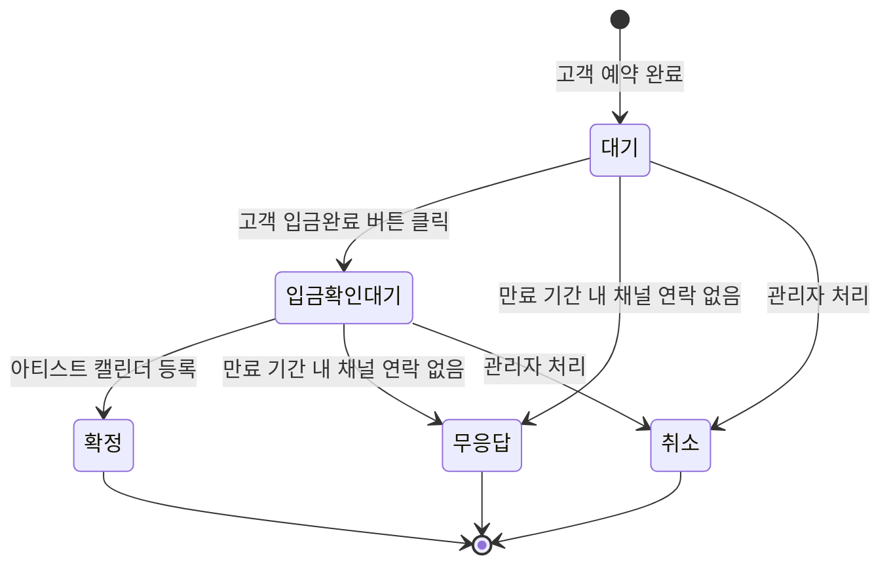
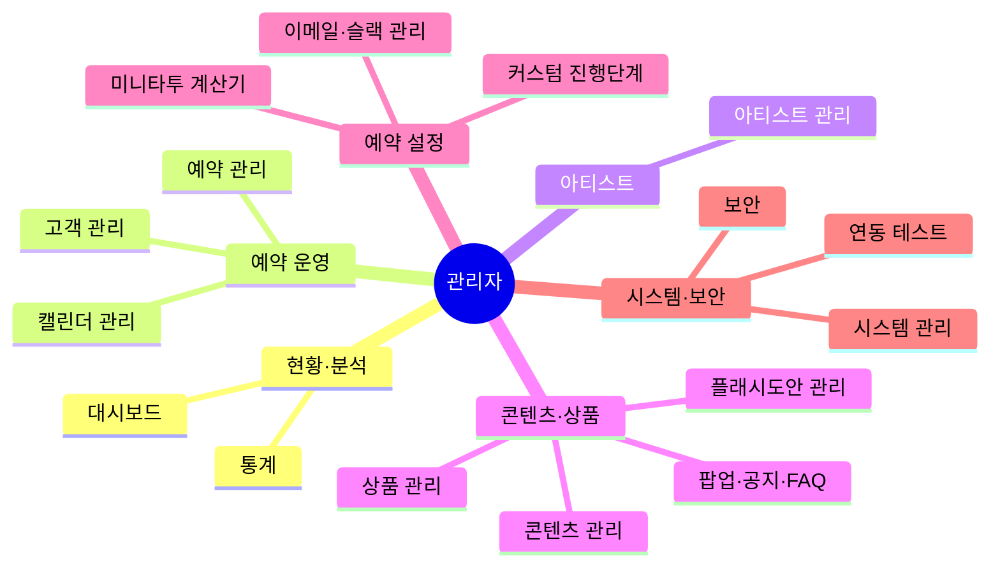
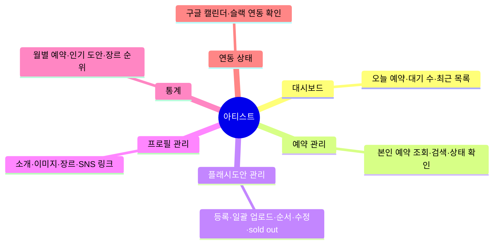
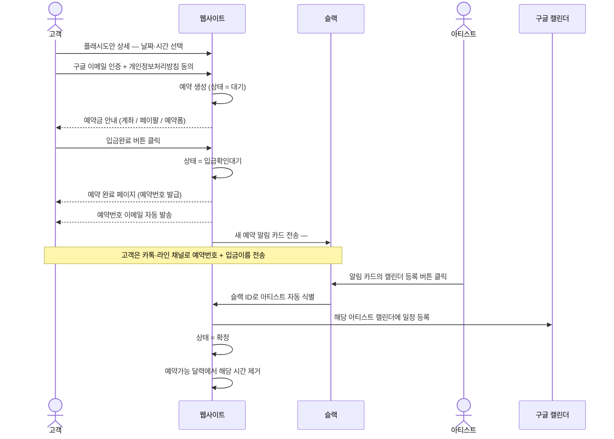
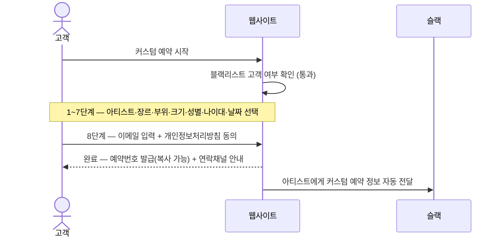
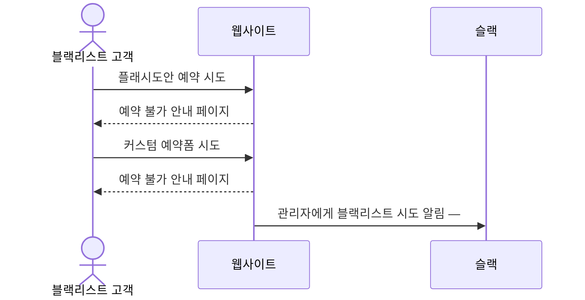
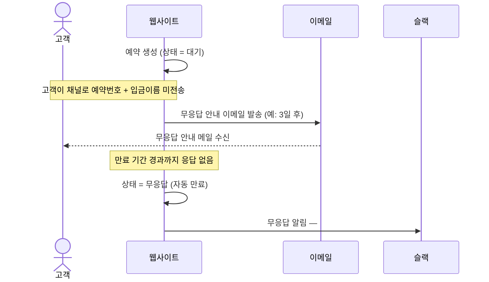

# tattoo_project

타투샵 예약·관리 플랫폼의 워크플로우 문서. **관리자 · 아티스트 · 고객** 3개 역할로 구성된다.

## 목차

- [역할 개요](#역할-개요)
- [예약 상태 흐름 (공통)](#예약-상태-흐름-공통)
- [1. 관리자 워크플로우](#1-관리자-워크플로우)
- [2. 아티스트 워크플로우](#2-아티스트-워크플로우)
- [3. 고객 워크플로우](#3-고객-워크플로우)
- [4. 핵심 시나리오](#4-핵심-시나리오)

## 역할 개요

| 역할 | 진입 | 핵심 책임 |
| --- | --- | --- |
| 관리자 | 관리자 로그인 | 예약·아티스트·도안·콘텐츠·통계 전체 관리, 시스템 운영 |
| 아티스트 | 아티스트 로그인 | 본인 예약 조회, 본인 도안·프로필 관리, 캘린더 등록 |
| 고객 | 비로그인 | 도안 탐색, 플래시/커스텀 예약, 예약 조회 |

> 로그인 실패 5회 시 계정 잠금. 잠금 해제는 관리자만 가능.

## 예약 상태 흐름 (공통)

세 역할이 공유하는 예약 상태 전이.

---

## 1. 관리자 워크플로우

진입: 관리자 로그인(실패 5회 잠금) · 종료: 로그아웃. 기능을 6개 도메인으로 묶었다.

### 1.1 페이지 구조

### 1.2 기능 상세

| 도메인 | 메뉴 | 핵심 기능 |
| --- | --- | --- |
| 현황·분석 | 대시보드 | 오늘 예약·대기 수·최근 목록·월별 통계 그래프 |
| 현황·분석 | 통계 | 기간별 예약·매출, 아티스트·장르별, 인기 도안·장르 순위, 엑셀 |
| 예약 운영 | 예약 관리 | 플래시·커스텀 목록(검색·메모·엑셀), 취소·무응답 목록, 블랙리스트 관리 |
| 예약 운영 | 고객 관리 | 고객 목록, 예약 이력, 재방문 고객 표시 |
| 예약 운영 | 캘린더 관리 | 영업시간, 예약 가능·대기 만료 기간, 휴무일·임시 휴업 |
| 아티스트 | 아티스트 관리 | 계정 생성, 노출 순서, 정보 수정(캘린더·슬랙 ID·예약 시간·휴가), 활성화, 비번 초기화, 아이디 찾기 |
| 콘텐츠·상품 | 플래시도안 관리 | 등록·일괄 업로드·순서·수정·삭제, 카테고리·장르, sold out |
| 콘텐츠·상품 | 상품 관리 | 등록·수정·삭제·순서·품절, 카테고리, 스마트스토어 링크 |
| 콘텐츠·상품 | 팝업·공지·FAQ | 팝업·공지사항·FAQ 등록·수정·삭제 |
| 콘텐츠·상품 | 콘텐츠 관리 | 배너·소개·위치·안내·약관 문구, SNS 링크, 다국어(한/영) |
| 예약 설정 | 미니타투 계산기 | 계산 항목 관리, 예약금 금액 설정(플래시·커스텀) |
| 예약 설정 | 커스텀 진행단계 | 커스텀 예약 진행단계 수정·삭제 |
| 예약 설정 | 이메일·슬랙 관리 | 이메일 템플릿·발송 로그·발송 주기, 슬랙 채널별 알림·테스트 |
| 시스템·보안 | 연동 테스트 | 슬랙 알림·구글 캘린더 연동 테스트 |
| 시스템·보안 | 보안 | 비밀번호 변경, 계정 추가, 접속 로그, 계정 잠금 해제 |
| 시스템·보안 | 시스템 관리 | 시스템 점검 모드(점검 페이지 표시) |

---

## 2. 아티스트 워크플로우

진입: 아티스트 로그인(실패 5회 잠금) · 종료: 로그아웃. 본인 데이터 범위로 한정된다.

### 2.1 페이지 구조

---

## 3. 고객 워크플로우

비로그인으로 진입한다. 실제 예약 과정은 [4. 핵심 시나리오](#4-핵심-시나리오) 참고.

### 3.1 사이트 구조

---

## 4. 핵심 시나리오

플랫폼의 실제 동작을 역할 간 상호작용 관점에서 정리한다.

### 시나리오 1 — 플래시도안 예약 → 확정 (정상 흐름)

### 시나리오 2 — 커스텀 예약 (8단계)

### 시나리오 3 — 블랙리스트 고객 예약 시도 (차단)

### 시나리오 4 — 무응답 예약 자동 만료

