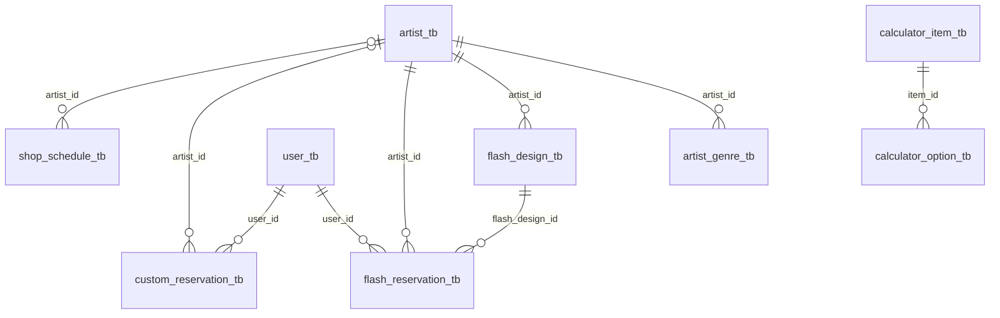

<!-- ⚠️ 이 파일은 생성물입니다. 직접 수정하지 마세요.
     원본: packages/contract/src/tables.ts, packages/contract/src/flows.ts
     재생성: pnpm db:generate -->

# ERD · 테이블 명세

`packages/contract/src/tables.ts`에서 생성됩니다. 스키마를 바꾸려면 그 파일을 고치고
`pnpm db:generate`를 실행하세요.

## 관계도

## 화면 흐름 ↔ 컬럼

퍼널 단계가 어떤 컬럼을 채우는지입니다. `packages/contract/src/flows.ts`에 선언되어 있고,
`pnpm db:check`가 이 대응이 깨졌는지 검사합니다.

### 플래시 도안 예약

- 결과 테이블: `flash_reservation_tb`
- 화면 코드: `apps/web/src/app/[locale]/flash/[id]/reserve/flash-reserve-funnel.tsx`

| # | 단계 | 질문 | 채우는 컬럼 | 건너뛰기 |
| --- | --- | --- | --- | --- |
| 1 | `date` | 언제 방문하시겠어요? | `flash_reservation_tb.preferred_date` | — |
| 2 | `time` | 몇 시가 좋으세요? | `flash_reservation_tb.preferred_time` | — |
| 3 | `email` | 예약 안내를 받을 이메일을 알려주세요 | `user_tb.email` | — |
| 4 | `confirm` | 마지막으로 확인해 주세요 (요약 + 개인정보처리방침 동의) | — | — |

### 커스텀 예약 (README 시나리오 2)

- 결과 테이블: `custom_reservation_tb`
- 화면 코드: `apps/web/src/app/[locale]/custom/custom-funnel.tsx`

| # | 단계 | 질문 | 채우는 컬럼 | 건너뛰기 |
| --- | --- | --- | --- | --- |
| 1 | `artist` | 어떤 아티스트에게 받고 싶으세요? | `custom_reservation_tb.artist_id` | 가능 |
| 2 | `genre` | 어떤 스타일을 원하세요? | `custom_reservation_tb.tattoo_genre` | — |
| 3 | `bodyPart` | 어디에 받으실 예정인가요? | `custom_reservation_tb.body_part` | — |
| 4 | `size` | 크기는 어느 정도가 좋을까요? | `custom_reservation_tb.tattoo_size` | — |
| 5 | `gender` | 성별을 알려주세요 | `custom_reservation_tb.gender` | — |
| 6 | `age` | 연령대를 알려주세요 | `custom_reservation_tb.age` | — |
| 7 | `date` | 희망하는 날짜가 있으세요? | `custom_reservation_tb.preferred_date` | 가능 |
| 8 | `contact` | 이메일 입력 + 개인정보처리방침 동의 | `user_tb.email` | — |

## 테이블 명세

| 테이블 | 이름 | 상태 | 설명 |
| --- | --- | --- | --- |
| `admin_tb` | 관리자 | 기존 | 관리자 계정. AdminMapper.findByEmail이 조회한다. |
| `artist_tb` | 아티스트 | 기존 | 아티스트 계정 + 공개 프로필. 로그인 계정과 프로필이 같은 행에 있다. |
| `artist_genre_tb` | 아티스트 장르 | 신설 | 아티스트의 주력 장르. 한 아티스트가 여러 장르를 갖고, 응답에서는 genres 배열로 묶인다. 별도 테이블로 뺀 이유는 장르로 도안을 필터링하고 통계를 내야 하기 때문 — 콤마 문자열로 두면 둘 다 못 한다. |
| `user_tb` | 고객 | 신설 | 비로그인 고객. 이메일만으로 식별한다. 같은 이메일로 재예약하면 같은 행을 재사용해 재방문 고객을 판별한다 (README 고객 관리). |
| `flash_design_tb` | 플래시 도안 | 신설 | 바로 예약 가능한 완성 도안. |
| `flash_reservation_tb` | 플래시 예약 | 신설 | 도안을 골라 날짜·시간을 지정하는 예약. 프론트 퍼널 4단계로 수집된다. |
| `custom_reservation_tb` | 커스텀 예약 | 신설 | 도안부터 상담하는 예약. 프론트 퍼널 8단계로 수집된다. |
| `token_blacklist_tb` | 토큰 블랙리스트 | 기존 | 로그아웃된 JWT. TokenCleanupScheduler가 매일 03시에 만료분을 삭제한다. 리프레시 토큰이 없어 발급 토큰이 24시간 유효하므로 이 테이블이 유일한 무효화 수단이다. |
| `notice_tb` | 공지사항 | 신설 | 관리자가 등록하는 공지. 고정 공지가 메인 화면에 노출된다. |
| `faq_tb` | FAQ | 신설 | 자주 묻는 질문. 이용 안내 화면에 표시된다. |
| `site_content_tb` | 사이트 문구 | 신설 | 배너·위치·관리법 등 관리자가 편집하는 문구. locale 열로 한/영을 분리해 다국어를 지원한다 — 컬럼을 title_ko/title_en으로 늘리면 언어 추가마다 스키마가 바뀐다. |
| `deposit_policy_tb` | 예약금 정책 | 신설 | 예약금 금액과 입금 계좌, 대기 만료 일수. 행이 하나만 존재한다(id=1). 설정값이라 테이블 하나에 몰아넣었다. |
| `calculator_item_tb` | 계산기 항목 | 신설 | 미니타투 계산기의 질문 항목 (예: '크기', '색상', '부위'). |
| `calculator_option_tb` | 계산기 선택지 | 신설 | 항목별 선택지와 가산 금액. |
| `custom_option_tb` | 커스텀 선택지 | 신설 | 커스텀 예약 퍼널의 선택지 (장르·부위·크기·성별·연령대). 프론트에 하드코딩하면 장르 하나 추가에도 배포가 필요해진다. |
| `shop_schedule_tb` | 영업 일정 | 신설 | 휴무일·임시휴업. 여기에 있는 날짜는 예약 가능 목록에서 제외된다. 정기 휴무(월요일)는 요일 규칙이라 별도 컬럼으로 두었다. |

### `admin_tb` — 관리자

관리자 계정. AdminMapper.findByEmail이 조회한다.

| 컬럼 | 타입 | NULL | 기본값 | 도메인 필드 | 설명 |
| --- | --- | --- | --- | --- | --- |
| `id` | BIGINT AI |  |  | `id` | PK |
| `email` | VARCHAR(255) |  |  | `email` | 로그인 이메일 |
| `password_hash` | VARCHAR(255) |  |  | `passwordHash` | BCrypt 해시. 현재 백엔드는 평문 비교 중이므로 반드시 고쳐야 한다 (API-CONTRACT 0.3) |
| `login_fail_count` | INT |  | `0` |  | 연속 로그인 실패 횟수. 5회에서 잠금 (API-CONTRACT 0.4) |
| `locked_at` | DATETIME | ✓ |  |  | 계정 잠금 시각. NULL이면 정상. 관리자만 해제 가능 |
| `created_at` | DATETIME |  | `CURRENT_TIMESTAMP` |  | 생성 시각 |
| `updated_at` | DATETIME |  | `CURRENT_TIMESTAMP ON UPDATE CURRENT_TIMESTAMP` |  | 수정 시각 |

### `artist_tb` — 아티스트

아티스트 계정 + 공개 프로필. 로그인 계정과 프로필이 같은 행에 있다.

| 컬럼 | 타입 | NULL | 기본값 | 도메인 필드 | 설명 |
| --- | --- | --- | --- | --- | --- |
| `id` | BIGINT AI |  |  | `id` | PK |
| `email` | VARCHAR(255) |  |  | `email` | 로그인 이메일. JWT subject로 본인 식별에 쓴다 |
| `password_hash` | VARCHAR(255) |  |  | `passwordHash` | BCrypt 해시 |
| `is_verified` | TINYINT(1) |  | `0` | `isVerified` | 이메일 인증 완료 여부 |
| `artist_name` | VARCHAR(100) |  |  | `artistName` | 활동명. 공개 목록에 노출된다 |
| `introduce` | TEXT | ✓ |  | `introduce` | 소개글. 비어 있을 수 있다 |
| `artist_image_url` | VARCHAR(512) | ✓ |  | `artistImageUrl` | 프로필 이미지. NULL이면 프론트가 무채색 패턴을 생성한다 |
| `instagram_form_url` | VARCHAR(512) | ✓ |  |  | 인스타그램 링크. 응답에서는 socialLinks.instagram으로 묶인다 |
| `kakao_form_url` | VARCHAR(512) | ✓ |  |  | 카카오 채널 링크 → socialLinks.kakao |
| `line_form_url` | VARCHAR(512) | ✓ |  |  | LINE 링크 → socialLinks.line |
| `watts_form_url` | VARCHAR(512) | ✓ |  |  | WhatsApp 링크 → socialLinks.whatsapp (엔티티 필드명이 watts인 점 유지) |
| `slack_member_id` | VARCHAR(64) | ✓ |  |  | 슬랙 회원 ID. 알림 카드의 캘린더 등록 버튼으로 아티스트를 식별한다 (README 시나리오 1) |
| `google_calendar_id` | VARCHAR(255) | ✓ |  |  | 구글 캘린더 ID. 확정 시 여기에 일정을 등록한다 |
| `display_order` | INT |  | `0` | `displayOrder` | 공개 목록 노출 순서. 작을수록 먼저 |
| `is_active` | TINYINT(1) |  | `1` | `isActive` | false면 공개 목록에서 제외. 계정은 유지된다 |
| `login_fail_count` | INT |  | `0` |  | 연속 로그인 실패 횟수 |
| `locked_at` | DATETIME | ✓ |  |  | 계정 잠금 시각 |
| `created_at` | DATETIME |  | `CURRENT_TIMESTAMP` |  | 생성 시각 |
| `updated_at` | DATETIME |  | `CURRENT_TIMESTAMP ON UPDATE CURRENT_TIMESTAMP` |  | 수정 시각 |

### `artist_genre_tb` — 아티스트 장르

아티스트의 주력 장르. 한 아티스트가 여러 장르를 갖고, 응답에서는 genres 배열로 묶인다. 별도 테이블로 뺀 이유는 장르로 도안을 필터링하고 통계를 내야 하기 때문 — 콤마 문자열로 두면 둘 다 못 한다.

| 컬럼 | 타입 | NULL | 기본값 | 도메인 필드 | 설명 |
| --- | --- | --- | --- | --- | --- |
| `artist_id` | BIGINT |  |  |  | artist_tb.id |
| `genre` | VARCHAR(50) |  |  |  | 장르명 (예: '라인워크', '블랙워크') |
| `display_order` | INT |  | `0` |  | 표시 순서 |

### `user_tb` — 고객

비로그인 고객. 이메일만으로 식별한다. 같은 이메일로 재예약하면 같은 행을 재사용해 재방문 고객을 판별한다 (README 고객 관리).

| 컬럼 | 타입 | NULL | 기본값 | 도메인 필드 | 설명 |
| --- | --- | --- | --- | --- | --- |
| `id` | BIGINT AI |  |  | `id` | PK |
| `email` | VARCHAR(255) |  |  | `email` | 예약 시 입력한 이메일. 로그인은 하지 않는다 |
| `is_verified` | TINYINT(1) |  | `0` | `isVerified` | 구글 이메일 인증 완료 여부 (README 시나리오 1) |
| `is_blacklisted` | TINYINT(1) |  | `0` |  | true면 예약 시도가 차단되고 관리자에게 슬랙 알림이 간다 (README 시나리오 3) |
| `blacklist_reason` | VARCHAR(500) | ✓ |  |  | 블랙리스트 지정 사유. 관리자 전용 |
| `created_at` | DATETIME |  | `CURRENT_TIMESTAMP` |  | 생성 시각 |
| `updated_at` | DATETIME |  | `CURRENT_TIMESTAMP ON UPDATE CURRENT_TIMESTAMP` |  | 수정 시각 |

### `flash_design_tb` — 플래시 도안

바로 예약 가능한 완성 도안.

| 컬럼 | 타입 | NULL | 기본값 | 도메인 필드 | 설명 |
| --- | --- | --- | --- | --- | --- |
| `id` | BIGINT AI |  |  | `id` | PK |
| `artist_id` | BIGINT |  |  | `artistId` | artist_tb.id |
| `image_url` | VARCHAR(512) |  |  | `imageUrl` | 도안 이미지 |
| `estimated_time` | INT |  |  | `estimatedTime` | 예상 시술 시간(분). 시간대 마감 계산에 쓴다 |
| `price` | VARCHAR(50) |  |  | `price` | 표시용 금액 문자열 (예: '90,000'). 엔티티가 String이라 유지했다 — 계산에는 쓰지 않는다 |
| `price_amount` | INT | ✓ |  |  | 집계용 숫자 금액. price가 문자열이라 매출 통계를 낼 수 없어 별도로 둔다 (API-CONTRACT 4.3) |
| `category` | VARCHAR(50) | ✓ |  | `category` | 크기 분류 (예: '미니', '스탠다드', '라지') |
| `genre` | VARCHAR(50) | ✓ |  | `genre` | 장르. 공개 목록 필터에 쓴다 |
| `is_sold_out` | TINYINT(1) |  | `0` | `isSoldOut` | true면 목록에는 남지만 예약할 수 없다 |
| `display_order` | INT |  | `0` | `displayOrder` | 노출 순서 |
| `created_at` | DATETIME |  | `CURRENT_TIMESTAMP` |  | 생성 시각 |
| `updated_at` | DATETIME |  | `CURRENT_TIMESTAMP ON UPDATE CURRENT_TIMESTAMP` |  | 수정 시각 |

### `flash_reservation_tb` — 플래시 예약

도안을 골라 날짜·시간을 지정하는 예약. 프론트 퍼널 4단계로 수집된다.

| 컬럼 | 타입 | NULL | 기본값 | 도메인 필드 | 설명 |
| --- | --- | --- | --- | --- | --- |
| `id` | BIGINT AI |  |  | `id` | PK |
| `reservation_number` | VARCHAR(20) |  |  | `reservationNumber` | 고객 조회용 번호 (예: 'TT-2026-0148'). id를 노출하면 순차 대입으로 남의 예약을 볼 수 있어 별도 컬럼이 필요하다 (API-CONTRACT 0.7) |
| `user_id` | BIGINT |  |  | `userId` | user_tb.id. 이메일로 찾거나 새로 만든다 |
| `flash_design_id` | BIGINT |  |  | `flashDesignId` | flash_design_tb.id |
| `artist_id` | BIGINT |  |  | `artistId` | 도안의 아티스트를 예약 시점에 복사해 둔다. 도안이 다른 아티스트에게 넘어가도 과거 예약의 담당자는 바뀌지 않아야 한다 |
| `preferred_date` | DATE |  |  | `preferredDate` | 희망 시술 날짜 |
| `preferred_time` | TIME |  |  | `preferredTime` | 희망 시술 시각 |
| `status` | TINYINT |  | `0` | `status` | 예약 상태 — 0=WAITING 1=PAYMENT_PENDING 2=CONFIRMED 3=NO_RESPONSE 4=CANCELLED |
| `contact_channel_url` | VARCHAR(512) | ✓ |  | `contactChannelUrl` | 고객에게 안내한 연락 채널 |
| `privacy_agreed_at` | DATETIME |  |  |  | 개인정보처리방침 동의 시각. 동의 여부를 boolean으로만 두면 언제 동의했는지 증명할 수 없다 |
| `admin_memo` | TEXT | ✓ |  | `adminMemo` | 관리자 내부 메모. 고객에게 보이지 않는다 |
| `requested_at` | DATETIME |  | `CURRENT_TIMESTAMP` | `requestedAt` | 예약 접수 시각. 만료 기간 계산의 기준 |
| `created_at` | DATETIME |  | `CURRENT_TIMESTAMP` |  | 생성 시각 |
| `updated_at` | DATETIME |  | `CURRENT_TIMESTAMP ON UPDATE CURRENT_TIMESTAMP` |  | 수정 시각 |

### `custom_reservation_tb` — 커스텀 예약

도안부터 상담하는 예약. 프론트 퍼널 8단계로 수집된다.

| 컬럼 | 타입 | NULL | 기본값 | 도메인 필드 | 설명 |
| --- | --- | --- | --- | --- | --- |
| `id` | BIGINT AI |  |  | `id` | PK |
| `reservation_number` | VARCHAR(20) |  |  | `reservationNumber` | 고객 조회용 번호 |
| `user_id` | BIGINT |  |  | `userId` | user_tb.id |
| `artist_id` | BIGINT | ✓ |  | `artistId` | NULL 허용 — 고객이 '추천해 주세요'를 고르면 상담 후 배정한다 |
| `tattoo_genre` | VARCHAR(50) |  |  | `tattooGenre` | 희망 스타일 |
| `body_part` | VARCHAR(50) |  |  | `bodyPart` | 시술 부위 |
| `tattoo_size` | VARCHAR(50) |  |  | `tattooSize` | 희망 크기 |
| `gender` | VARCHAR(20) |  |  | `gender` | 성별. '선택하지 않음'도 값으로 저장한다 |
| `age` | VARCHAR(20) |  |  | `age` | 연령대 (예: '20대'). 미성년자는 보호자 동의가 필요하다 |
| `preferred_date` | DATE | ✓ |  | `preferredDate` | NULL 허용 — 커스텀은 상담에서 날짜를 정할 수 있다 |
| `funnel` | VARCHAR(100) | ✓ |  | `funnel` | 유입 경로 (예: '인스타그램'). 마케팅 분석용 |
| `status` | TINYINT |  | `0` | `status` | 예약 상태 — 0=WAITING 1=PAYMENT_PENDING 2=CONFIRMED 3=NO_RESPONSE 4=CANCELLED |
| `progress_step` | VARCHAR(100) | ✓ |  | `progressStep` | 커스텀 진행단계. 관리자가 목록을 편집한다 (README 예약 설정) |
| `contact_channel_url` | VARCHAR(512) | ✓ |  | `contactChannelUrl` | 안내한 연락 채널 |
| `privacy_agreed_at` | DATETIME |  |  |  | 개인정보처리방침 동의 시각 |
| `admin_memo` | TEXT | ✓ |  | `adminMemo` | 관리자 내부 메모 |
| `requested_at` | DATETIME |  | `CURRENT_TIMESTAMP` | `requestedAt` | 접수 시각 |
| `created_at` | DATETIME |  | `CURRENT_TIMESTAMP` |  | 생성 시각 |
| `updated_at` | DATETIME |  | `CURRENT_TIMESTAMP ON UPDATE CURRENT_TIMESTAMP` |  | 수정 시각 |

### `token_blacklist_tb` — 토큰 블랙리스트

로그아웃된 JWT. TokenCleanupScheduler가 매일 03시에 만료분을 삭제한다. 리프레시 토큰이 없어 발급 토큰이 24시간 유효하므로 이 테이블이 유일한 무효화 수단이다.

| 컬럼 | 타입 | NULL | 기본값 | 도메인 필드 | 설명 |
| --- | --- | --- | --- | --- | --- |
| `id` | BIGINT AI |  |  | `id` | PK |
| `token` | VARCHAR(512) |  |  | `token` | Bearer 접두어를 제거한 순수 JWT |
| `expires_at` | DATETIME |  |  | `expiresAt` | 토큰 만료 시각. 이 시각이 지나면 삭제 대상 |
| `created_at` | DATETIME |  | `CURRENT_TIMESTAMP` | `createdAt` | 등록 시각 |

### `notice_tb` — 공지사항

관리자가 등록하는 공지. 고정 공지가 메인 화면에 노출된다.

| 컬럼 | 타입 | NULL | 기본값 | 도메인 필드 | 설명 |
| --- | --- | --- | --- | --- | --- |
| `id` | BIGINT AI |  |  | `id` | PK |
| `title` | VARCHAR(200) |  |  | `title` | 제목 |
| `body` | TEXT |  |  | `body` | 본문 |
| `is_pinned` | TINYINT(1) |  | `0` | `isPinned` | true면 목록 최상단 + 메인 화면 노출 |
| `created_at` | DATETIME |  | `CURRENT_TIMESTAMP` | `createdAt` | 작성 시각 |
| `updated_at` | DATETIME |  | `CURRENT_TIMESTAMP ON UPDATE CURRENT_TIMESTAMP` |  | 수정 시각 |

### `faq_tb` — FAQ

자주 묻는 질문. 이용 안내 화면에 표시된다.

| 컬럼 | 타입 | NULL | 기본값 | 도메인 필드 | 설명 |
| --- | --- | --- | --- | --- | --- |
| `id` | BIGINT AI |  |  | `id` | PK |
| `question` | VARCHAR(300) |  |  | `question` | 질문 |
| `answer` | TEXT |  |  | `answer` | 답변 |
| `display_order` | INT |  | `0` | `displayOrder` | 표시 순서 |
| `created_at` | DATETIME |  | `CURRENT_TIMESTAMP` |  | 생성 시각 |
| `updated_at` | DATETIME |  | `CURRENT_TIMESTAMP ON UPDATE CURRENT_TIMESTAMP` |  | 수정 시각 |

### `site_content_tb` — 사이트 문구

배너·위치·관리법 등 관리자가 편집하는 문구. locale 열로 한/영을 분리해 다국어를 지원한다 — 컬럼을 title_ko/title_en으로 늘리면 언어 추가마다 스키마가 바뀐다.

| 컬럼 | 타입 | NULL | 기본값 | 도메인 필드 | 설명 |
| --- | --- | --- | --- | --- | --- |
| `locale` | VARCHAR(5) |  |  |  | 언어 코드 ('ko' | 'en') |
| `content_key` | VARCHAR(100) |  |  |  | 문구 키 (예: 'heroTitle', 'aftercareGuide') |
| `content_value` | TEXT |  |  |  | 문구 본문. 줄바꿈을 그대로 보존한다 |
| `created_at` | DATETIME |  | `CURRENT_TIMESTAMP` |  | 생성 시각 |
| `updated_at` | DATETIME |  | `CURRENT_TIMESTAMP ON UPDATE CURRENT_TIMESTAMP` |  | 수정 시각 |

### `deposit_policy_tb` — 예약금 정책

예약금 금액과 입금 계좌, 대기 만료 일수. 행이 하나만 존재한다(id=1). 설정값이라 테이블 하나에 몰아넣었다.

| 컬럼 | 타입 | NULL | 기본값 | 도메인 필드 | 설명 |
| --- | --- | --- | --- | --- | --- |
| `id` | BIGINT AI |  |  | `id` | PK. 항상 1 |
| `flash_amount` | INT |  |  | `flashAmount` | 플래시 예약금(원) |
| `custom_amount` | INT |  |  | `customAmount` | 커스텀 상담 예약금(원) |
| `bank_name` | VARCHAR(50) | ✓ |  |  | 입금 은행 |
| `account_number` | VARCHAR(50) | ✓ |  |  | 계좌번호 |
| `holder_name` | VARCHAR(50) | ✓ |  |  | 예금주 |
| `paypal_url` | VARCHAR(512) | ✓ |  | `paypalUrl` | 해외 고객용 페이팔 링크 |
| `expire_after_days` | INT |  | `3` | `expireAfterDays` | 대기 상태가 자동 만료되기까지의 일수 (README 시나리오 4) |
| `created_at` | DATETIME |  | `CURRENT_TIMESTAMP` |  | 생성 시각 |
| `updated_at` | DATETIME |  | `CURRENT_TIMESTAMP ON UPDATE CURRENT_TIMESTAMP` |  | 수정 시각 |

### `calculator_item_tb` — 계산기 항목

미니타투 계산기의 질문 항목 (예: '크기', '색상', '부위').

| 컬럼 | 타입 | NULL | 기본값 | 도메인 필드 | 설명 |
| --- | --- | --- | --- | --- | --- |
| `id` | BIGINT AI |  |  | `id` | PK |
| `name` | VARCHAR(50) |  |  | `name` | 항목명 |
| `display_order` | INT |  | `0` |  | 표시 순서 |
| `created_at` | DATETIME |  | `CURRENT_TIMESTAMP` |  | 생성 시각 |
| `updated_at` | DATETIME |  | `CURRENT_TIMESTAMP ON UPDATE CURRENT_TIMESTAMP` |  | 수정 시각 |

### `calculator_option_tb` — 계산기 선택지

항목별 선택지와 가산 금액.

| 컬럼 | 타입 | NULL | 기본값 | 도메인 필드 | 설명 |
| --- | --- | --- | --- | --- | --- |
| `id` | BIGINT AI |  |  | `id` | PK |
| `item_id` | BIGINT |  |  |  | calculator_item_tb.id |
| `label` | VARCHAR(100) |  |  | `label` | 선택지 문구 (예: '3~5cm') |
| `amount` | INT |  | `0` | `amount` | 가산 금액(원). 0이면 프론트가 표시하지 않는다 |
| `display_order` | INT |  | `0` |  | 표시 순서 |
| `created_at` | DATETIME |  | `CURRENT_TIMESTAMP` |  | 생성 시각 |
| `updated_at` | DATETIME |  | `CURRENT_TIMESTAMP ON UPDATE CURRENT_TIMESTAMP` |  | 수정 시각 |

### `custom_option_tb` — 커스텀 선택지

커스텀 예약 퍼널의 선택지 (장르·부위·크기·성별·연령대). 프론트에 하드코딩하면 장르 하나 추가에도 배포가 필요해진다.

| 컬럼 | 타입 | NULL | 기본값 | 도메인 필드 | 설명 |
| --- | --- | --- | --- | --- | --- |
| `id` | BIGINT AI |  |  | `id` | PK |
| `option_group` | VARCHAR(30) |  |  |  | 선택지 묶음 ('genre' | 'bodyPart' | 'size' | 'gender' | 'age') |
| `value` | VARCHAR(100) |  |  |  | 선택지 값. 예약 레코드에 이 문자열이 그대로 저장된다 |
| `description` | VARCHAR(200) | ✓ |  |  | 감을 잡게 하는 비유 (예: '동전 크기 정도'). 크기 항목에만 쓴다 |
| `display_order` | INT |  | `0` |  | 표시 순서 |
| `created_at` | DATETIME |  | `CURRENT_TIMESTAMP` |  | 생성 시각 |
| `updated_at` | DATETIME |  | `CURRENT_TIMESTAMP ON UPDATE CURRENT_TIMESTAMP` |  | 수정 시각 |

### `shop_schedule_tb` — 영업 일정

휴무일·임시휴업. 여기에 있는 날짜는 예약 가능 목록에서 제외된다. 정기 휴무(월요일)는 요일 규칙이라 별도 컬럼으로 두었다.

| 컬럼 | 타입 | NULL | 기본값 | 도메인 필드 | 설명 |
| --- | --- | --- | --- | --- | --- |
| `id` | BIGINT AI |  |  | `id` | PK |
| `artist_id` | BIGINT | ✓ |  |  | NULL이면 샵 전체 휴무, 값이 있으면 해당 아티스트만 휴가 |
| `closed_date` | DATE |  |  |  | 휴무 날짜 |
| `reason` | VARCHAR(200) | ✓ |  |  | 사유 (예: '광복절 연휴') |
| `created_at` | DATETIME |  | `CURRENT_TIMESTAMP` |  | 생성 시각 |
| `updated_at` | DATETIME |  | `CURRENT_TIMESTAMP ON UPDATE CURRENT_TIMESTAMP` |  | 수정 시각 |

## 예약 상태 코드

`status` 컬럼 값입니다. `packages/contract/src/domain.ts`의 `ReservationStatus`에서
생성되며, DDL의 CHECK 제약도 같은 값에서 나옵니다.

| 값 | 상수 | 다음 상태 |
| --- | --- | --- |
| `0` | `WAITING` | PAYMENT_PENDING, NO_RESPONSE, CANCELLED |
| `1` | `PAYMENT_PENDING` | CONFIRMED, NO_RESPONSE, CANCELLED |
| `2` | `CONFIRMED` | 종료 |
| `3` | `NO_RESPONSE` | 종료 |
| `4` | `CANCELLED` | 종료 |
